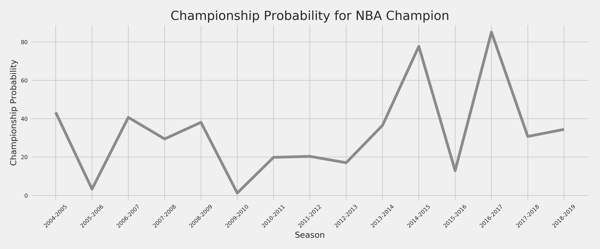
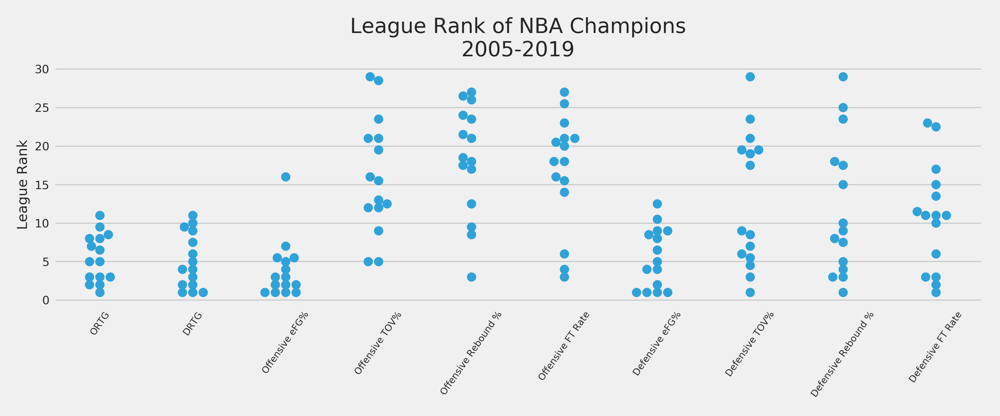
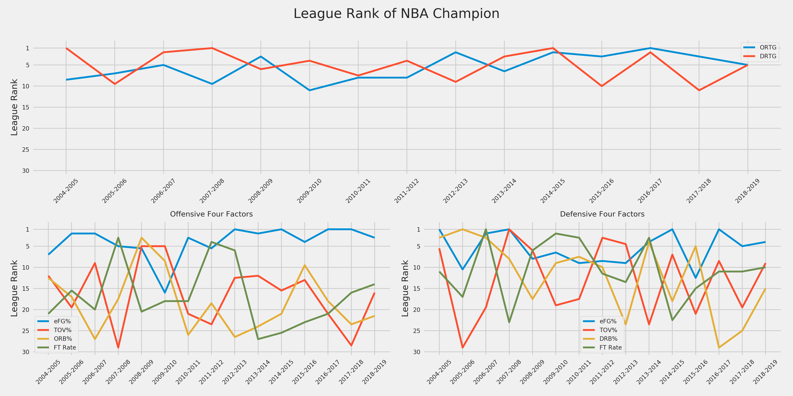
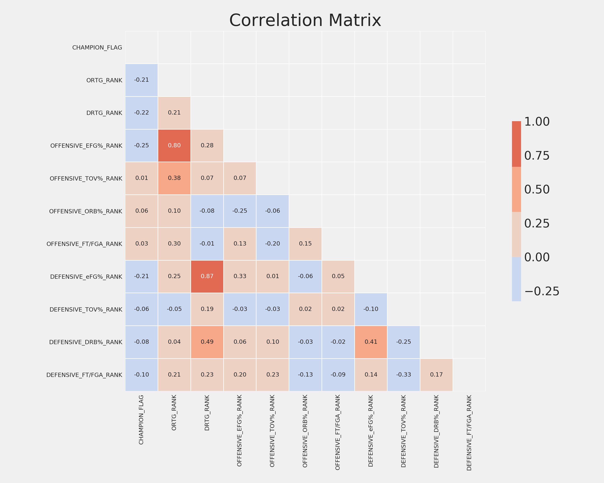

 <h1>NBA Title Predictions</h1> 

 <h3>June 2020</h3> 

---
#### Motivation
Motivated by [Thomas Bassine's](https://twitter.com/tvbassine) Nylon Calculus piece *[How close was each team to an NBA title this decade?](https://fansided.com/2020/06/01/nylon-calculus-nba-expected-titles-decade/)*, which utilized betting market odds to quantify how close each organization has come to winning an NBA championship, I sought to calculate each team's championship probabilities based instead on box-score data. Using data dating back to the 2004-2005 season, I built a logistic regression model to predict each team's probability of taking home the Larry O'Brien trophy based on their respective regular season league rank in offensive and defensive four factors and ratings. Aggregating these probabilities over time I calculated each team's championships above or below expectation. The following dives into which teams won more titles than we might have expected, which teams fell short of expectations, and which team was quantifiably the worst organization over the last 15 seasons.

As Thomas points out, the NBA and sports in general are often viewed from a binary 'championship or bust' lens. My hope is to provide an alternative viewpoint, as he has done, to quantify the success of NBA organizations beyond NBA titles won. Further, I seek to answer such questions as 'does it really take a top-10 offense and defense to win a title?' by exploring the relationship between box-score data and championship probabilities. Lastly, I make predictions for the 2019-2020 season based on data through the suspension of the regular season.

#### Table of Contents
1. [Championships Above/Below Expectations Since 2004-2005](#championships-abovebelow-expectations-since-2004-2005)
2. [Maximum Championship Probability Historically](#maximum-championship-probability-historically)
3. [Championships Above/Below Expectation Since 2010-2019](#championships-abovebelow-expectation-since-2010-2019)
4. [NBA Champions Probability Over Time](#nba-champions-probability-over-time)
5. [Team Probability Breakdowns](#team-probability-breakdowns)
6. [What Does It Take To Win An NBA Title?](#what-does-it-take-to-win-an-nba-title)
7. [How Did Each Team Win the Title?](#how-did-each-team-win-the-title)
8. [The Model](#the-model)
9. [2019-2020 Predictions](#2019-2020-predictions)
10. [Next Steps](#next-steps)
11. [References](#references)

#### Championships Above/Below Expectations Since 2004-2005
Aggregating the championship probabilities since 2004-2005, we're able to calculate the `Championships Predicted` for a given team based on their league rank in offensive and defensive four factors and ratings. We can then compare this to the actual number of titles a team won to create  `Championships Above/Below Expectations`. For example, San Antonio was predicted to win 3.55 titles but only won 3 and thus was -0.55 championships below expectation. Alternatively, Golden State was predicted to win 2.89 championships and in reality won 3, 0.11 championships above expectation.

Since 2004-2005 San Antonio (`3.55`) and Golden State (`2.89`) are in a league of their own in terms of predicted championships. No other organization was predicted to win more than one championship. Boston (`0.95`), Miami (`0.76`), and Oklahoma City (`0.65`) round out the top five. On the other end of the spectrum, Charlotte (`0.01`) and Brooklyn (`0.01`) are quantifiably the two worst organizations over the same time period.

Oklahoma City (`-0.65`), Atlanta (`-0.59`), and San Antonio (`-0.55`) underperformed their expectations the most, while Miami (`2.24`), the Los Angeles Lakers (`1.49`), and Dallas (`.65`) over-performed their expectations the most. Miami stands out as a team whose predicted championships are far too low for its talent level. However, we must keep in mind this is based solely on regular season performance and does not factor in the ability of a a player like LeBron to increase his performance in the playoffs. We will see something similar with the Los Angeles Clippers this season, who are decent favorites to win the title, but rank much lower based on the model.

#### Maximum Championship Probability Historically

The table below displays each team's best season since 2004-2005 in terms of championship probabilities. As an example, Oklahoma City, which underperformed its championship expectation the most of any team, was closest to winning a title during the 2012-2013 season during which the model gave them a 37.77% chance of coming out on top.

The Minnesota Timberwolves stand out for their exceptional ineptitude as their most promising season of the last 15 years occurred 15 years ago and resulted in only a 1.59% probability of winning the championship.

#### Championships Above/Below Expectation Since 2010-2019

To compare to Thomas' analysis, here are each team's championships above or below expectations since the 2009-2010 season.

Our predictions differ the most for the Spurs, whom the box-score model predicted to win 2.26 championships and the betting market odds predicted to win 1.03. The next largest difference existed for the Cavs whom the betting market odds predicted 0.99 titles and the box-score model predicted 0.22 championships. The two approaches agreed most for the Suns, both of which predicted .03 championships.

#### NBA Champions Probability Over Time
To provide a sense of how likely the eventual NBA champion was to take home the title each seasons, I've plotted the probability of each NBA champion over the last 15 seasons. This appears to be a good proxy for how evenly distributed talent was in the NBA and visualizes how dominant Golden State was between 2014-2015 and 2016-2017.

#### Team Probability Breakdowns
For a deeper dive into championship probabilities for a selection of interesting teams, I've created *Consistently Good*, *Missed Their Opportunity*, *Seized the Moment*, *Could Have Had More*, *Got More Than Deserved*, and *The Basement* buckets below.

**Consistently Good**
Since 2004-2005 only nine teams recorded a season with a championship probability greater than 40%. San Antonio had five of them. The only thing more surprising is that their highest championship probability occurred in a season in which they didn't take home the title. The Spurs' 2015-2016 season ranks as having the highest championship probability (`77.5%`) for a team that came up short of winning the title. Interestingly enough, Golden State's 2015-2016 season (`56.3%`) ranks second on that list. Note the gold diamonds indicate championships won.

 

Golden State owns three of the top four highest championship probabilities since 2004-2005. Their 2014-2015 to 2016-2017 run tallied probabilities of 77.7%, 56.3%, and 85.1%, respectively. Note the continuous gold line in the plot below signifies back-to-back titles.

 

While not as dominant as the Spurs or Warriors, the Heat had an impressive run of their own between 2011-2012 and 2013-2014. Interestingly, their highest championship probability came in 2013-2014, the season in which they failed to three-peat.  

 

**Missed Their Opportunity**
Oklahoma City, Atlanta, Houston, Orlando, and Phoenix all find themselves on the unfortunate side of history. Each put together an impressive season, or two, but weren't able to come out victorious. Milwaukee's 2018-2019 season would also fall on this list but I've excluded them as they've followed it up with another high-championship probability season that has yet to conclude.

 

 

 

 

 

 

**Seized the Moment**
Dallas and Toronto simply made the most of their opportunity. As we will explore later, they each provide good case studies in how teams can improve in specific areas season over season to increase their championship probability.

 

 

**Could Have Had More**
Boston recorded a 49% probability of defending their title in 2008-2009 but came up short, the third-highest probability of a team to not win a title.

 

Cleveland's 2008-2009 season, in which LeBron won his first MVP, was the eighth highest championship probability for a team that did not go on to win a title.

 

**Got More Than Deserved**
The Laker's 2009-2010 title came in as lowest probability (1.2%) for a team that ended up winning the championship.

 

**The Basement**
Thankfully for the Brooklyn Nets, the Charlotte Hornets were also predicted to win a whopping 0.01 championships since 2004-2005.  

 

#### What Does It Take To Win An NBA Title?

The dataset used to build the championship model can also be used to analyze where NBA champions ranked across the league in offensive and defensive four factors and ratings.

It does appear that teams must rank in the top-10 in both offense and defense but how they accomplish that can vary greatly. From an offensive perspective, outside of having a top ~8 eFG%, teams have won the title with a TOV%, OREB%, and FT Rate ranging from 3rd to 29th. Defensively, title winners have consistently had a top ~12 eFG%, but we see a similar trend in TOV%, DREB%, and FT Rate with winners ranking between 1st and 29th.

 

The plots below illustrate the league rank of NBA champions over time across offensive and defensive four factors and ratings. The top plot again visualizes the necessity of having a top-10 offense and defense. Once that context has been set, it's interesting to note the change in importance between defense and offense over the last 15 seasons. Six of the 8 NBA Champions between 2004-2005 and 2011-2012 ranked higher across the league in defensive rating than in offensive rating. Since then, five of the last seven title winners have ranked equal or higher in offensive rating than in defensive rating, including the most recent four champions.

Diving deeper, we see that this recent trend towards the importance of offensive rating is driven mostly by eFG%. Four of the most recent seven champions led the league in eFG%. The last team to win a championship without ranking in the top-5 of eFG% was the Los Angeles Lakers in 2009-2010. In terms of TOV%, OREB%, and FT Rate, there's much higher variance in the league rank of NBA champions as compared to eFG%. Teams have found various ways to put together a top-10 offense by excelling in one or more of the metrics. Recently, over the same time period that we observed champions really excelling in eFG%, we've seen a decrease in league rank across the other offensive four factors. All of the most recent six champions have ranked 10th or worse in TOV%, OREB%, and FT Rate.

On the defensive side, there appears to be less of a noticeable trend as the offensive four factors. Defensive eFG% has consistently been the most important ranking and increased in importance over the last five seasons. Only the 2015-2016 Cleveland Cavaliers ranked outside of the top-5 during that time period.  

#### How Did Each Team Win the Title?
Having examined trends in the league rank of NBA champions in aggregate over the last 15 years, let's dive into the individual winners themselves. Starting with Golden State, the team that embodies the trend towards the importance of eFG%. They've led the league in offensive eFG% five straight seasons and ranked in the top-5 for defensive eFG% for six straight seasons. Note championships are denoted via **bold** season tick markers on the x-axis. It's hard to believe Golden State has not ranked higher than league-average in any of the other offensive four factors since 2011-2012. Defensively, Golden State's run coincides with a stark decrease in their DREB% ranking, although that has trended upward recently back to league average.

 
In contrast to Golden State, San Antonio has consistently ranked higher on the defensive end of the floor. They've been in the top-5 of DRTG in 11 of the past 15 seasons, consistently ranking in the top-10 in defensive eFG%, TOV%, and DREB%. Although, recently they've fallen off in allowing opponents to shoot an above-average eFG%. Their normal below-average defensive TOV% embodies their conservative schemes and personnel over the years.
  

 
The Heat's big three era is impressive in it's relatively clean lifecycle, improving from 29th ORTG in 2007-2008 to 2nd in 2012-2013 followed by a decent to 21st in 2014-2015. Similarly, Miami went from 26th in DRTG to 4th and back down to 21st over that same time period. Miami's offensive improvements appear to be driven by a large improvements in eFG% and FT Rate. The Heat's aggressive defense led the way between 2012 and 2014, ranking third, fourth, and first, respectively, in TOV%.
  

 

The Laker's first title in their back-to-back campaign came as a result of a third-ranked offense, which ranked in the top-5 in eFG%, OREB%, and TOV%. The following season their offensive rating dipped to 11th as their eFG% decreased to 16th. To make up for the decrease in offensive efficiency, the Laker's defense improved from 6th to 4th in 2009-2010, which coincided with a steep increase in DREB%. The Laker's defensive calling card during that time period was their ability to limit opponents from getting to the line. They ranked 6th and 2nd in their back-to-back seasons in defensive FT Rate and then led the league in the metric the following three seasons.

 

Despite having a top-5 offense for four consecutive seasons between 2015 and 2018, Cleveland's defense trailed behind significantly with an average ranking of 19th. Fortunately for the Cavs, they were able to jump up to 10th in 2015-2016. During that season they improved to 5th in DREB% despite ranking 12th, 21st, and 15th in eFG%, TOV%, and FT Rate, respectively. Interestingly, their 15th-ranked defensive FT Rate sits in between two seasons in which they ranked 1st and 3rd in the league.  

 

Following a similar pattern as Golden State, Toronto's championship coincided with a top-5 rank in offensive and defensive eFG%. Surprisingly, all three of Toronto's other offensive four factors decreased from the previous season during their championship run. They went from 4th in TOV% in 2017-2018 to 16th in 2018-2019. Similarly, they decreased from 11th in OREB% to 21st over the same time period. Defensively, Toronto's largest improvement in 2018-2019 occurred in FT Rate, in which they went from 25th to 10th.

 

Boston's 2007-2008 championship stands as one of the largest season-over-season improvements in both ORTG and DRTG for a title team. Boston went from 16th to 1st defensively and 28th to 9th offensively. Both of these improvements coincide with sharp increases in the team's rank in eFG%. Boston improved from 27th to 5th offensively and 20th to 1st defensively. It's crazy what adding two future hall of famers will do to a team.

 

Dallas' 2010-2011 championship coincides with a one-season jump in offensive eFG%. The Mavs' league rank of 3rd that season is sandwiched between a rank of 12 the season before and a rank of 15 the following year. Defensively, Dallas' calling card was their 3rd-ranked FT Rate, the highest they've ranked in the metric over the last 15 seasons.

#### The Model
To calculate the championship probabilities outlined above, I fit a logistic regression on data dating back to the 2004-2005 season. As inputs into the model, I used the regular season rank of each team's offensive and defensive four factors and ratings to predict the eventual champion. I chose to include the rank as opposed to the underlying continuous variable as the rank is relative to each seasonal context and thus robust to changes in play types. For instance, we want the model to be robust to the league's recent de-emphasis of offensive rebounding. By using the rank of OREB% instead of the continuous value we are able to do just that.

To examine which inputs were most predictive of championship success, I've included a table of feature importances below. Unsurprisingly, a team's rank in ORTG and DRTG are at the top of the list. As we saw earlier, historically teams have needed a top-10 offense and defense to have a shot at a championship. Interestingly, a team's rank in offensive eFG% sits in between those two inputs as the second-most predictive feature. Even more interesting, a teams's rank in defensive TOV% is more predictive than their rank in defensive eFG%. Based on the analysis earlier, defensive TOV% didn't appear to be as correlated with a team's championship prospects as their defensive eFG%. Most surprising was that a team's rank in offensive FT Rate is inversely related to a team's championship probability.

To further this analysis, I looked at the correlation between the model inputs. Focusing in on the the left-most column associated with `CHAMPION_FLAG`, which was coded as 1 for a team that won a championship and 0 for a team that was ultimately unsuccessful, we observe the correlation with all model inputs and championship winners. Keep in mind that all model inputs are coded 1-30 with 1 representing the best rank in the league. So for example, `OFFENSIVE_EFG%_RANK` has the highest correlation with winning a championship (`-0.25`), which means the higher the team ranks in the league the more correlated they are with winning a championship. We see that DRTG and ORTG are the most correlated with championships as are offensive and defensive eFG%. Surprisingly, offensive eFG% is the only offensive metric that is positively correlated with championships.

#### 2019-2020 Predictions
Now for the fun part. Based on the league rankings of each team's offensive and defensive four factors and ratings through the suspension of the regular season on March 11th, here are the predicted probabilities for each team to win the 2020 NBA championship. The Laker's 62.62% probability of taking home the Larry O'Brien trophy comes in as the fourth highest of any team since the 2004-2005 season. Only the 2016-2017 and 2014-2015 Warriors and 2015-2016 Spurs had higher probabilities. Milwaukee's 24.91% probability ranks as the 23rd highest over the same time period. Thus, the 2019-2020 field is one of the most top-heavy of the past 16 seasons. Toronto's championship probability decreased from 34.4% last season to 5.19% this year. Utah stands out as a team with higher championship probability than the consensus might expect and inversely the Clippers are much lower than the betting markets suggest.  

#### Next Steps
From the model coefficients and analysis of league rankings for NBA champions across offensive and defensive four factors and ratings, we've shown the relative importance of each. A likely next step is to quantify the level of difficulty it takes to improve in each area. This will provide us more insight into the optimal team building strategy. Additionally, adding in some conditional aspect to the model to account for playoff matchups will provide us a more accurate representation of what it takes to win a title as the current model does not account for this.

#### References
1) Thomas Bassine - *How close was each team to an NBA title this decade?*   
https://fansided.com/2020/06/01/nylon-calculus-nba-expected-titles-decade/

#### Special Thanks
To [Taylor Spooner](https://github.com/spoonertaylor), the alchemist for turning my poor ideas, work, and code into things that are hopefully useful or interesting.
